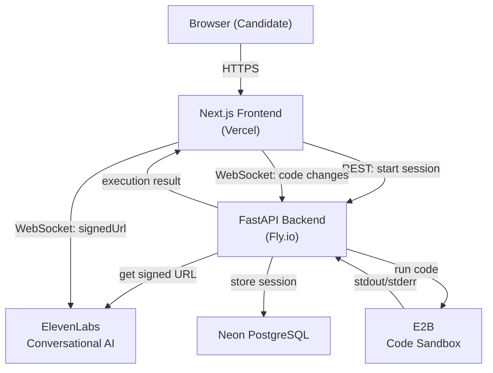
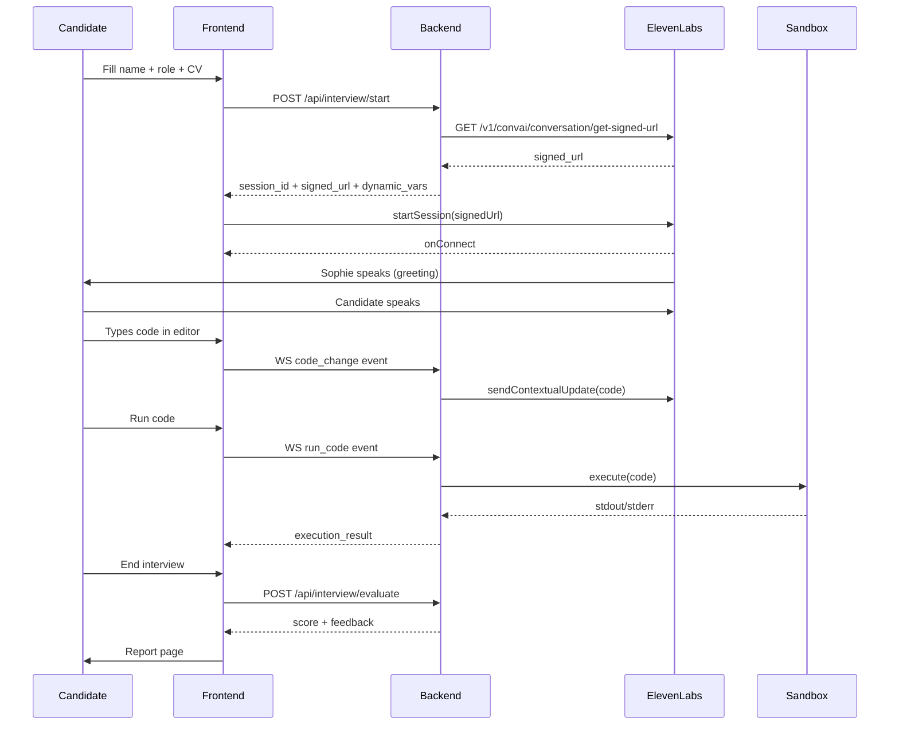

# InterviewAI


AI-powered technical interview simulator with a voice agent, live code editor, and automated feedback report.

## About

InterviewAI lets candidates practice technical interviews with Sophie, an AI interviewer powered by ElevenLabs Conversational AI. Sophie speaks, listens, asks coding questions, watches the candidate's editor in real time, and delivers a structured performance report at the end.

Built to solve a real problem: technical interview anxiety is hard to address without realistic, high-pressure practice. Mock interviews with friends are inconsistent. Written prep tools are silent. InterviewAI gives a voice to the process.

## Features

- Voice conversation with a realistic AI interviewer (ElevenLabs WebSocket)
- Live Monaco code editor (VS Code engine) shared with the agent in real time
- Code execution sandbox (E2B) - Python, JavaScript, TypeScript
- Session-scoped conversation transcript
- Automated evaluation report with scores and feedback
- CV/resume parsing from PDF to pre-fill interview context
- Dark IDE-style UI

## Tech Stack

| Layer | Tech |
|---|---|
| Frontend | Next.js 16, TypeScript, Monaco Editor, Framer Motion |
| Voice | ElevenLabs Conversational AI SDK (@elevenlabs/react) |
| Backend | FastAPI, Python 3.12, SQLAlchemy async |
| Database | Neon PostgreSQL (serverless) |
| Code Execution | E2B sandbox API |
| Frontend Deploy | Vercel |
| Backend Deploy | Fly.io |

## Architecture



## Session Flow



## Problem and Solution

**Problem:** ElevenLabs Conversational AI was disconnecting immediately after Sophie's greeting message in production.

Root causes found through deep investigation:

1. **SDK version bug** - `@elevenlabs/react` v1.0.1 crashed with `TypeError: Cannot read properties of undefined (reading 'error_type')` when receiving certain server messages. Fixed by upgrading to v1.0.2.

2. **Quota exceeded** - The ElevenLabs account hit its conversation quota limit during testing, causing `closeCode: 1002` with message `"This request exceeds your quota limit."`. The `onDisconnect` callback was not logging the disconnect reason, masking this.

3. **Agent turn timeout** - The agent was configured with `turn_timeout: 7` seconds. ElevenLabs closes the session if no audio is detected within 7 seconds of Sophie finishing. Updated to 30 seconds via the Agents API.

4. **Unstable React props** - `dynamicVariables` was passed directly from state, creating a new object reference on every parent re-render. Added `useMemo` with deep equality to keep the reference stable across re-renders.

5. **Stale connection pool** - Two Fly.io machines were sharing a SQLAlchemy async connection pool. Connections went stale between requests. Fixed with `pool_pre_ping=True` and `pool_recycle=300`.

## Local Setup

```bash
# Backend
cd backend
cp ../.env.example .env  # fill in your keys
pip install -r requirements.txt
uvicorn main:app --reload

# Frontend
cd frontend
cp .env.local.example .env.local  # set NEXT_PUBLIC_API_URL
npm install
npm run dev
```

**Required environment variables:**

```
ELEVENLABS_API_KEY=
ELEVENLABS_AGENT_ID=
DATABASE_URL=
E2B_API_KEY=
```

## Deploy

- **Backend**: `flyctl deploy --app interviewai-api`
- **Frontend**: `vercel deploy --prod` from `frontend/`

## Live Demo

[interviewai.stephanewamba.com](https://interviewai.stephanewamba.com)
